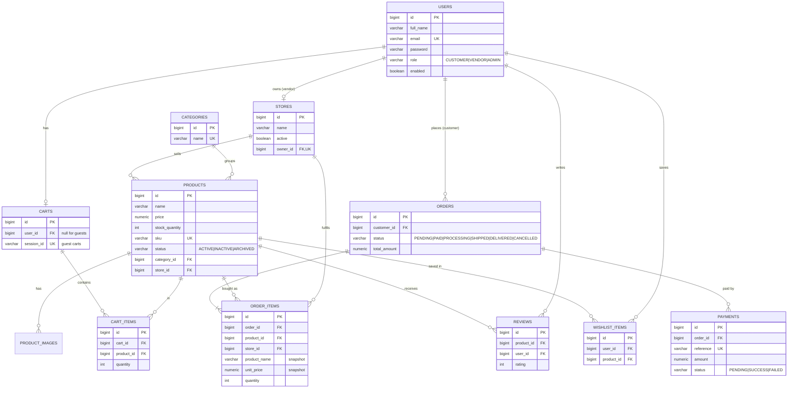

# ShopEase – Entity Relationship Diagram

Paste the block below into any Mermaid viewer (GitHub renders it automatically).

```mermaid
erDiagram
    USERS ||--o| STORES : "owns (vendor)"
    USERS ||--o| CARTS : "has"
    USERS ||--o{ ORDERS : "places (customer)"
    USERS ||--o{ REVIEWS : "writes"
    USERS ||--o{ WISHLIST_ITEMS : "saves"
    CATEGORIES ||--o{ PRODUCTS : "groups"
    STORES ||--o{ PRODUCTS : "sells"
    STORES ||--o{ ORDER_ITEMS : "fulfils"
    PRODUCTS ||--o{ PRODUCT_IMAGES : "has"
    PRODUCTS ||--o{ CART_ITEMS : "in"
    PRODUCTS ||--o{ ORDER_ITEMS : "bought as"
    PRODUCTS ||--o{ REVIEWS : "receives"
    PRODUCTS ||--o{ WISHLIST_ITEMS : "saved in"
    CARTS ||--o{ CART_ITEMS : "contains"
    ORDERS ||--|{ ORDER_ITEMS : "contains"
    ORDERS ||--o{ PAYMENTS : "paid by"

    USERS {
        bigint id PK
        varchar full_name
        varchar email UK
        varchar password
        varchar role "CUSTOMER|VENDOR|ADMIN"
        boolean enabled
    }
    STORES {
        bigint id PK
        varchar name
        boolean active
        bigint owner_id FK, UK
    }
    CATEGORIES {
        bigint id PK
        varchar name UK
    }
    PRODUCTS {
        bigint id PK
        varchar name
        numeric price
        int stock_quantity
        varchar sku UK
        varchar status "ACTIVE|INACTIVE|ARCHIVED"
        bigint category_id FK
        bigint store_id FK
    }
    CARTS {
        bigint id PK
        bigint user_id FK "null for guests"
        varchar session_id UK "guest carts"
    }
    CART_ITEMS {
        bigint id PK
        bigint cart_id FK
        bigint product_id FK
        int quantity
    }
    ORDERS {
        bigint id PK
        bigint customer_id FK
        varchar status "PENDING|PAID|PROCESSING|SHIPPED|DELIVERED|CANCELLED"
        numeric total_amount
    }
    ORDER_ITEMS {
        bigint id PK
        bigint order_id FK
        bigint product_id FK
        bigint store_id FK
        varchar product_name "snapshot"
        numeric unit_price "snapshot"
        int quantity
    }
    PAYMENTS {
        bigint id PK
        bigint order_id FK
        varchar reference UK
        numeric amount
        varchar status "PENDING|SUCCESS|FAILED"
    }
    REVIEWS {
        bigint id PK
        bigint product_id FK
        bigint user_id FK
        int rating
    }
    WISHLIST_ITEMS {
        bigint id PK
        bigint user_id FK
        bigint product_id FK
    }
```
